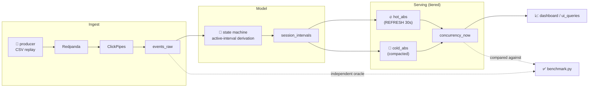

# 🦥 Snorlax

**Foreground-only concurrency, at streaming scale — on ClickHouse.**

Snorlax answers *"how many sessions are truly watching, right now?"* — not how many are open, paused, backgrounded, or silently timed out. Built for [Click-a-thon 2026](problem/PROBLEM_STATEMENT.md)'s SonyLIV challenge.

[](LICENSE)
[](https://clickhouse.com/)
[](producer/requirements.txt)
[](plan/PLAN.md)

---

## 🎯 Why "Snorlax"?

Because most sessions are, mechanically, asleep — paused, backgrounded, silent — and counting them as "watching" inflates every downstream decision (ad load, capacity, content calls). Snorlax's whole job is telling awake from asleep, at every minute, for every filter combination, without ever re-reading raw history.

## ✨ What it does

- 🔴 **Live ingestion** — a CSV-replaying producer streams session events into **Redpanda → ClickPipes → ClickHouse**, continuously.
- 🧠 **A real active-interval state machine** — turns raw `play` / `pause` / `background` / `heartbeat` / `ad` events into truly-active `[start, end)` windows per session, with deterministic tie-breaking and gap/grace handling.
- 🧊🔥 **Hot/cold serving** — absolute concurrency per `(dimensions, minute)`, tiered so dashboards read `filter → sum → max/avg` and nothing else. No cumulative sums, no carry-in terms, no full-history rescans.
- ♻️ **Update-friendly** — open sessions and late heartbeats are absorbed incrementally (30s hot refresh, 1min cold compaction) — never a full rebuild.
- ✅ **Self-verifying** — every served number is checked against an independent, raw-events oracle. Zero mismatches is the bar.
- 📊 **Filterable at query time** — platform, country, content, video type, and (on the extended path) app/player version + audio/subtitle language.

## 🏗️ Architecture



See [`docs/DATA_FLOW.md`](docs/DATA_FLOW.md) for the full, traced-from-code pipeline diagram, and [`docs/SCHEMA.md`](docs/SCHEMA.md) for every table's DDL and reasoning.

## 🧩 The hard part, in one paragraph

A session isn't "active" just because it's open. `VideoSessionStart` seeds a session active immediately (heartbeats before the first explicit `Play` shouldn't be dropped); `pause` / `AppBackgrounded` / `VideoError` / ad-breaks end an active stretch; a heartbeat gap over **90s** closes it, with a **60s** grace tail. Events are collapsed per `(session, millisecond)` — with deactivate beating reactivate beating neutral — because ~29% of raw events tie on timestamp and an unresolved tie is nondeterministic across engines. The result is one row per session, an array of active islands, expanded to minute buckets, and counted with `uniqExact` — the "once per minute, no matter how many islands touch it" dedupe, for free. Full reasoning and every edge case: [`plan/PLAN.md`](plan/PLAN.md).

## 📂 Repository layout

```
.
├── problem/     📋 the challenge brief, dataset dictionary, and starting notes
├── plan/        🗺️  the design doc — decisions, trade-offs, and why we rejected alternatives
├── producer/    📼 event-stream simulator → Redpanda/ClickHouse (pauses, ads, drops, marathons, late arrivals)
├── migrations/  🛠️  idempotent schema migrations + the run_sql.py runner (build / reset / verify)
├── docs/        📖 traced-from-code architecture & schema reference
└── benchmark/   ✅ the query set we're judged on, verified against an independent raw-events oracle
```

## 🚀 Quick start

```bash
# 1 — point the producer + migration runner at your ClickHouse Cloud service
cd producer
cp .env.example .env              # fill in CLICKHOUSE_HOST / USER / PASSWORD / PORT
python -m venv .venv && source .venv/bin/activate
pip install -r requirements.txt

# 2 — build the schema
cd ../migrations
python run_sql.py --reset --build     # drop & recreate structure
python run_sql.py --migrate           # apply any pending migrations

# 3 — start the stream
cd ../producer
python produce_events.py

# 4 — verify what's being served matches raw ground truth
cd ../benchmark
pip install -r requirements.txt
python benchmark.py
```

`benchmark.py`'s exit code is the number of failed checks — `0` means the serving layer matches an independently-derived, raw-events reference to the row. See [`benchmark/BENCHMARK_QUERIES.md`](benchmark/BENCHMARK_QUERIES.md) for what each check proves.

## 🧪 Design principles

| Principle | How Snorlax applies it |
|---|---|
| **Correct over clever** | Every served number is cross-checked against a *structurally different* oracle re-derived straight from raw events — not just the same pipeline run twice. |
| **Absolute, not delta** | Both hot and cold tiers store absolute concurrency per `(dims, minute)` — queries are always `filter → sum → max/avg`, never a running cumulative sum. |
| **Incremental, not rebuilt** | Open sessions and late heartbeats update in place (30s/1min refresh cycles); nothing is ever recomputed from full history on a schedule. |
| **Scale-aware** | Serving-table size is proportional to *minutes × dimension combinations*, independent of event volume — the property that survives a 100× dataset. |

## 🗺️ Status & roadmap

Built against the plan in [`plan/PLAN.md`](plan/PLAN.md) — see §10 there for the live status, resolved pitfalls, and what's still open (pipeline execution on Cloud, ClickStack integration, dashboard polish, the sealed "unseen day" run).

- [x] Active-interval state machine, deterministic under same-millisecond ties
- [x] Hot/cold tiered serving with a race-free compaction boundary
- [x] Independent verification oracle (`benchmark/`, `migrations/*verify*`)
- [ ] ClickStack observability wired into the live pipeline
- [ ] Dashboard polish
- [ ] Unseen-day sealed run

## 🤝 Contributing

This is a hackathon build — see [`plan/PLAN.md`](plan/PLAN.md) §12 for the current team split and open workstreams. Schema changes go through [`migrations/`](migrations/README.md) as numbered, idempotent files — no stray `.sql` scattered around.

## 📄 License

[MIT](LICENSE)
